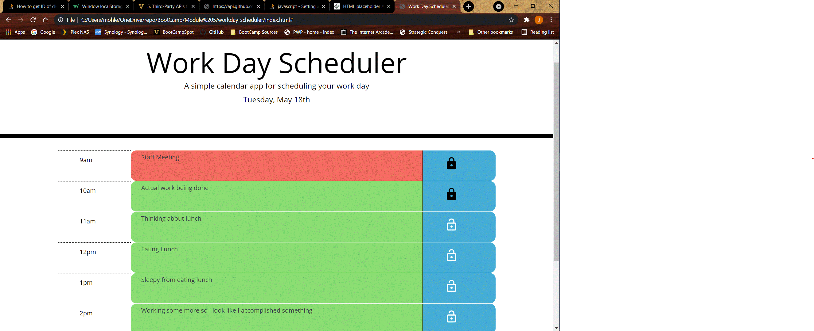

# Work Day Scheduler

## John Mohlenkamp
## May 18, 2021

## GitHub Location: https://github.com/Mohlenkamp/workday-scheduler

## GitPages Location: https://mohlenkamp.github.io/workday-scheduler/index.html

## Description
### This is a basic workday organizer that allows the user to put tasks into a daily scheduler. As long as the time has not expired, the user can add/lock-save/unlock-edit any task. When a task is locked, the details are stored, and will be retreived on a restart/refresh. The tasks are color coded to show events in the past(gray), present{this hour}(red), and future(green). When the end of the day is reached, the task details in storage are cleared for the next day.

